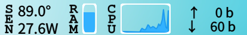
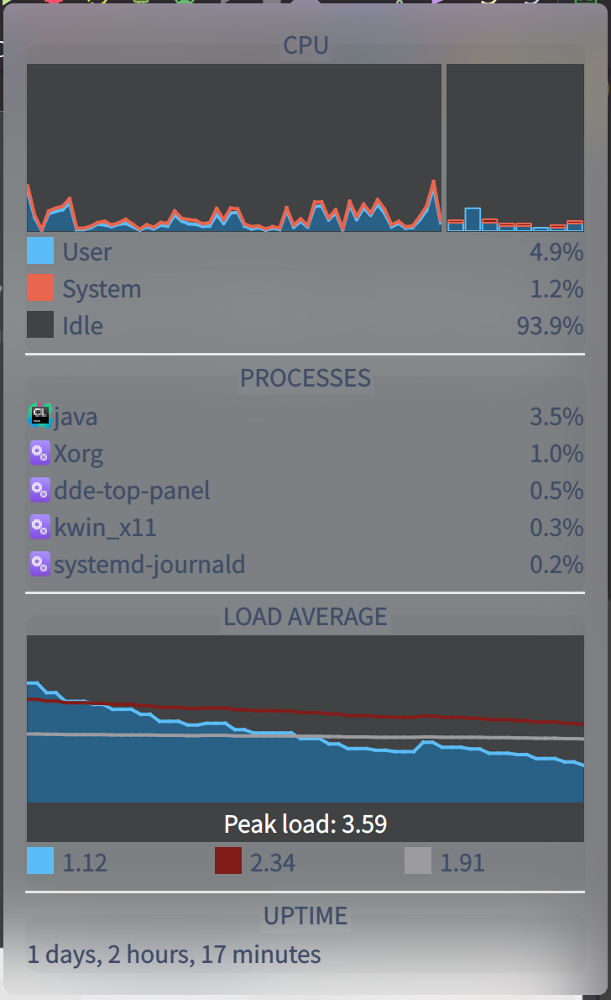
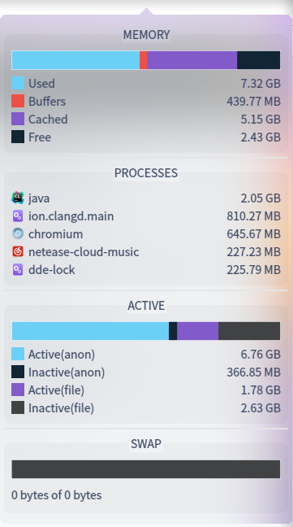
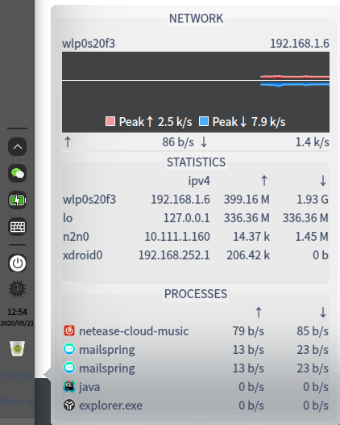
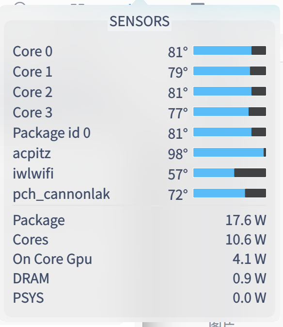

## dde-istate-menus

IStat menus on macOS alternative for DDE.

> This software has nothing to do with the Istat menu excepting adopting its UI design

> The main part of the system monitoring code in `utils` comes from [deepin-system-monitor](https://github.com/linuxdeepin/deepin-system-monitor)

> Still in development


* [ ] Network
    * [x] popup widget
    * [ ] dock widget
        * [x] text
        * [ ] chart
* [ ] Weather
* [ ] CPU
    * [x] popup widget
    * [ ] dock widget
        * [x] chart
        * [ ] text
* [ ] RAM
    * [x] popup widget
    * [ ] dock widget
        * [x] chart
        * [ ] text
* [ ] DISK
* [ ] Datetime
    * [x] dock widget (main code comes from the original datetime plugin in dde-dock)
    * [ ] popup widget
    
### Known issues

* dock widgets' text are really small even the widget has enough space, or text is too large and only part is shown on the widget. I think it is related to the dde-dock [issue](https://github.com/linuxdeepin/dde-dock/issues/271)

### Screenshot



#### CPU

dock-chart: 


popup widget:



#### RAM

dock-chart:


popup widget:



#### Network



#### Sensors




### How to use

#### Deepin V20

```shell
sudo apt install libqt5charts5
```

Download the `libdde_istate_menus.so` and put it to `~/.local/lib/dde-dock/plugins` or `/usr/lib/dde-dock/plugins`

Then:

```
sudo setcap cap_sys_rawio,cap_net_raw,cap_dac_read_search,cap_sys_ptrace+ep `which dde-dock`
```

logout out or reboot.

#### Arch

Thanks to @JunioCalu . It is on AUR now: [https://aur.archlinux.org/packages/dde-istate-menus/](https://aur.archlinux.org/packages/dde-istate-menus/)

#### Other distributions

It needs to be built from source on your own.

```shell
git clone https://github.com/SeptemberHX/dde-istate-menus.git
cd dde-istate-menus
cd nethogs
make libnethogs
cd ..
mkdir build
cd build
cmake ..
make
```

#### For sensors ability

1. Sensors are based on `lm-sensors` and `msr`
2. make sure run `sensors-detect` and give the right permission with `setcap`
3. make sure run `modprobe msr`
